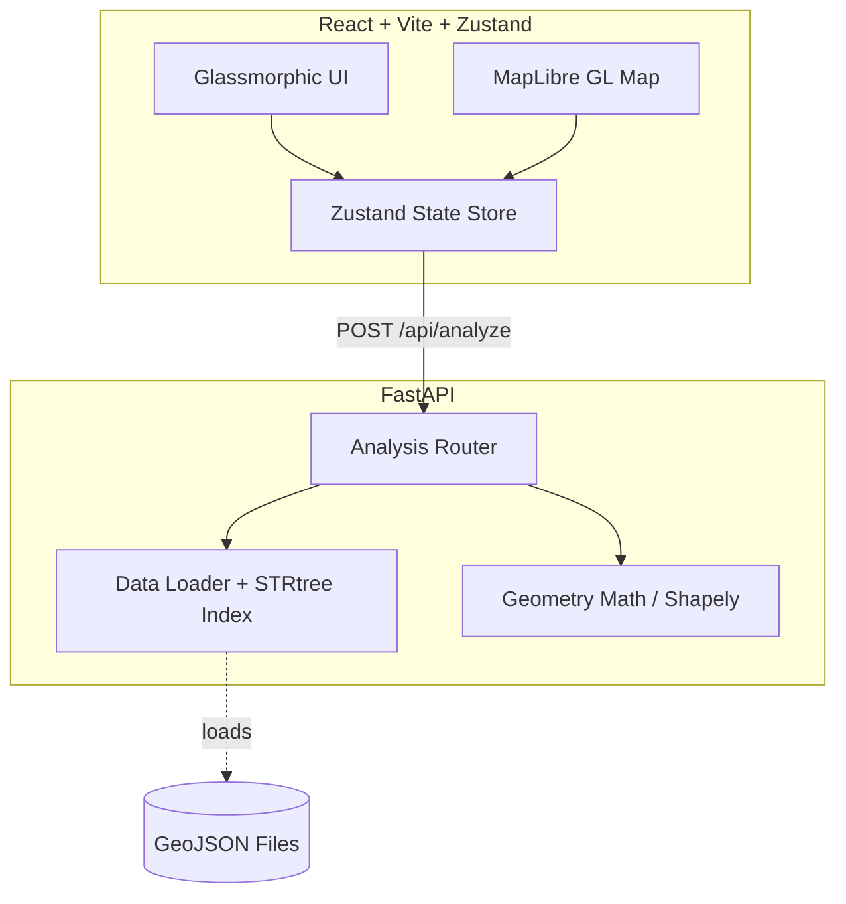

# 🌍 Buildable Land Analysis


A robust, production-grade spatial analysis tool that calculates the usable buildable area of land parcels by subtracting constraint layers (wetlands, FEMA flood zones, and transmission easements) alongside customizable setbacks.

## ✨ Features

- **Bespoke Frontend Redesign**: Built with React, Vite, Tailwind CSS, Zustand, and Framer Motion. Features a futuristic glassmorphic UI, dynamic lighting shaders, and fluid responsiveness.
- **High-Performance Spatial Math**: Backend is powered by FastAPI and Shapely, utilizing STRtree spatial indexing to process geographic geometry operations in milliseconds.
- **Interactive Map**: Seamless integration with MapLibre GL JS, allowing users to select parcels, view real-time acreage breakdowns, and manually draw custom exclusions or restorations.

---

## 🏗️ Architecture



---

## 🚀 How to Run the Code Locally

### Option 1: Using Docker (Recommended for Quick Start)

The easiest way to get the entire stack running is using Docker Compose.

1. **Clone the repository**:
   ```bash
   git clone <repo-url>
   cd buildable-land
   ```
2. **Start the containers**:
   ```bash
   docker-compose up --build
   ```
3. **Access the application**:
   - **Frontend App**: [http://localhost:5173](http://localhost:5173)
   - **Backend API Docs**: [http://localhost:8000/docs](http://localhost:8000/docs)

### Option 2: Running Manually (For Development)

If you prefer to run the services natively for active development, follow these steps:

#### 1. Start the Backend (FastAPI)
Open a terminal and navigate to the `backend` directory:
```bash
cd backend
```
Create and activate a virtual environment:
```bash
# Windows
python -m venv .venv
.venv\Scripts\activate

# Mac/Linux
python3 -m venv .venv
source .venv/bin/activate
```
Install dependencies and run the server:
```bash
pip install --upgrade pip
pip install -r requirements.txt
uvicorn main:app --reload --port 8000
```

#### 2. Start the Frontend (React + Vite)
Open a new terminal and navigate to the `frontend` directory:
```bash
cd frontend
```
Install dependencies and run the dev server:
```bash
npm install
npm run dev
```
The app will be available at `http://localhost:5173`. Ensure your `.env` file points `VITE_API_URL` to `http://localhost:8000`.

---

## 📊 Dataset Information

This project ships with **synthetic sample data** for a fictional slice of Llano County, TX (`backend/data/*.geojson`). The data is topologically realistic to demonstrate real constraint interactions out of the box.

If you wish to use real cadastral data, please replace the `.geojson` files in the `backend/data` directory following the exact schema patterns outlined in `APPROACH.md`.

---

## 🚢 Deployment

Ready for production? We have created a comprehensive step-by-step deployment guide.
Please see [Deploy.md](./Deploy.md) for instructions on deploying the frontend to **Vercel** and the backend to **Render**.
